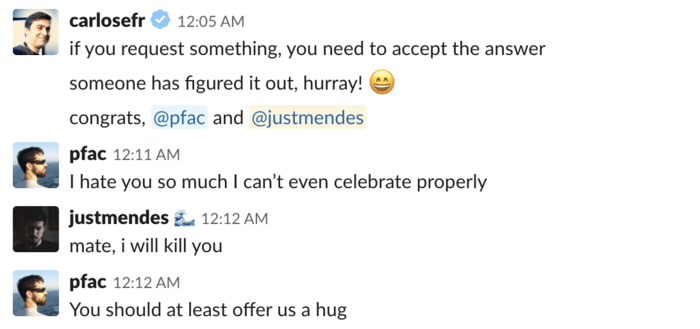
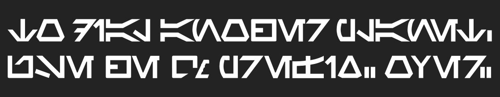
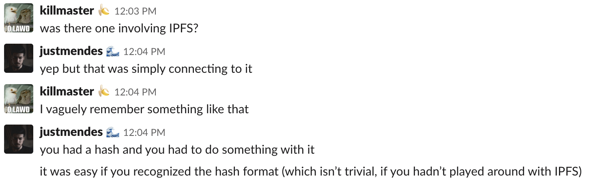
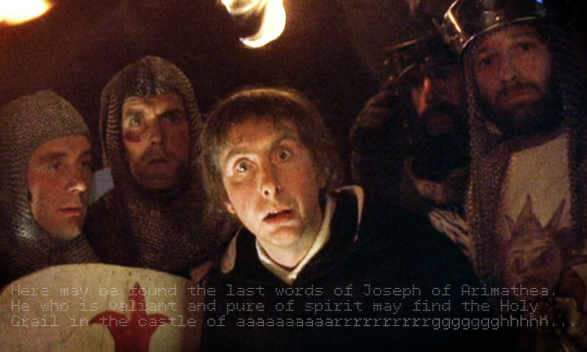
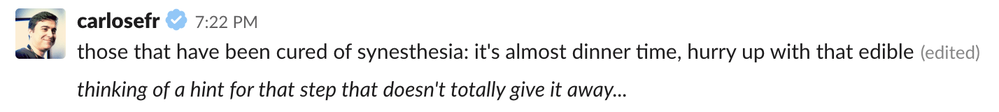
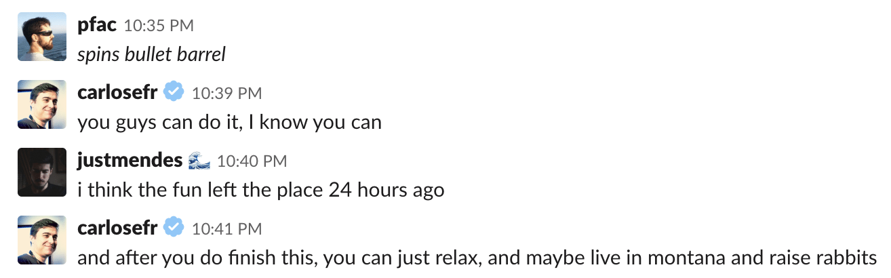
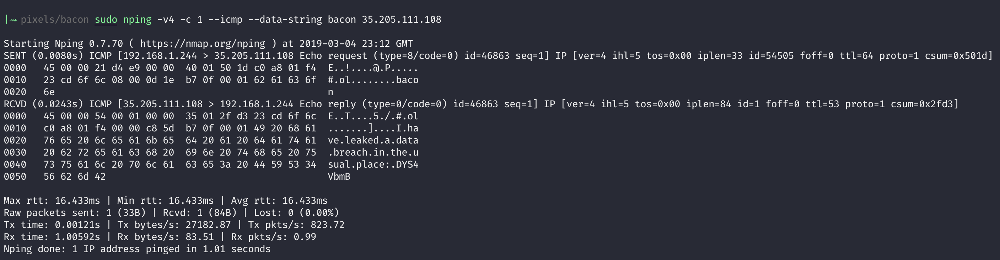

*This is the story of how I locked myself inside my room for 29 hours and only
left after finishing one of the craziest tech wargames/treasure hunt I have ever
taken part in.*



## Prelude

For those of you who don't know, [Pixels Camp](https://pixels.camp/) has a quiz show.

**To get to the quiz show, you have to ~~be tortured~~ get through a very good
and awesome and oh so fun, so amazingly fun qualifiers.**

The qualifiers run for 4 weeks. Then there's a week off. Then the 16 top players
get to find a partner to ~~violently murder the quizmaster~~ go on stage and
make fools of themselves. In order to do that, you get asked questions and
**then you fail. Invariably.** Eventually consistently.

2 editions ago, me and [@naps62](https://twitter.com/naps62) failed so hard we
won. The next year, we felt a bit more confident and got swept in the first
round. As far as logic goes, leave it by the door of the quiz finals and pick it
up afterwards. Think you know the answer? You don't. Been feeling like a champ?
**You're gonna get chewed up and then made fun of by the quizmaster and probably
your own coworkers who, incidentally, had been not only watching it live but
also recording everything for reaction gifs** (yes, oddly specific, I know).

Every year the qualifiers have a treasure hunt. That is one of my favorite
things in the world. First because you get mentally challenged. Second because
if you fail, you can just blame it on the lack of time and how popular you are.

> *yeah, I couldn't do the qualifier because it starts on a Friday night and I'm
> out at the pub unlike YOU LOSERS AHAHAHAH also does someone have any tips for
> step 3?*
>
> — stage one of doing the annual treasure hunt

Third because it gives you a reason to hate on another human being. And, let's
face it, we all love blaming our _beloved_ quizmaster,
[@carlosefr](https://twitter.com/carlosefr), for our own shortcomings.

> *I hate you quiz master, I haven't slept properly for 7 weeks, I've been
> putting on weight since 2016, don't feel like going to the gym and it's all
> because of YOU. YOU and YOUR STUPID TREASURE HUNT.*
>
> — stage two of the treasure hunt, commonly found on the Pixels Camp Slack

Enough chit chat, let's go through the solution.

---

## Step 1: The Cipher and The Dial

How does the treasure hunt work? Simple, two steps:

1. You start on step 1 and get to the next step
2. You repeat.

There are no rules, but there are patterns. It's never too complicated. It's
usually a single solution step. If you have an image, you have all it takes to
get to the next level. You won't need to do the hex dump of the image, convert
it to decimal, factor out the primes, convert to ascii and that will give you a
riddle to solve. If you have an image, everything you need is in there
(sometimes literally _in_ the image). And, again, it's usually a single step.
The multitude of steps like the one I showed you, will give you _uncertainty_.
You won't know if you are on the right track. But with the treasure hunt you
always know and you should keep this in mind. **If you find you are uncertain in
your solution, it's probably wrong.**

Right then, how did it start? We went to the [challenge
page](https://quiz.pixels.camp/challenge/2019-2-not-mojibake-09c6e098-43518c9be33e65de/)
(sidenote: there's a small chance this link might not be available due to the
challenge closing). And we had the explanation for the treasure hunt, a form for
submitting the final solution (given in the last step of the hunt) and an image.
This image:



Ah, a weird dialect. An unknown alphabet. A ciphertext! I have a background in
cryptography, so I knew _exactly_ what to do in this case...

Yep, that's right. **Reverse google search.**

The reverse google search lead nowhere. So what's next? My cryptographer brain
was prepared. Years of study and long nights reading through complex
mathematical formulas all built up to this moment.

You see, there's this little trick known as [frequency
analysis](https://learncryptography.com/attack-vectors/frequency-analysis).
Basically it consists in taking every symbol of the ciphertext, drawing it
carefully in a notebook and ignoring it because the right thing to do is to
google "weird alien fonts".

After spending some time in questionable websites which had every possible font,
the solution: **this is the Aurebesh alphabet!**

I found this quite amusing. It's literally the image for ["Languages in Star
Wars"](https://en.wikipedia.org/wiki/Languages_in_Star_Wars) in Wikipedia.

Translating it, we got:

> TO DIAL ANOTHER PLANET, USE THE QM PREFIX. OVER

Perfect, we need to use [IPFS](https://ipfs.io/). All the IPFS hashes start with
`Qm`. But where do we find the hash? Like I said, all we need is in the picture.

`curl`'ing the image, we got the following output:

```shell
$ curl https://quiz.pixels.camp/challenge/2019-2-not-mojibake-09c6e098-43518c9be33e65de/start.png

# [TRUNCATED]
��������������������������������������������������#�Ř��w�ֶYtEXtcommentBright Pixel Mars Research Facility: QmfXPu3fBiPt6x6F8bsoXyuur1KPbJRqxqC72whtJRuxG���IEND�B`�%
```

*Important sidenote: the original image had transparency, so it wouldn't show on
this page. I uploaded an altered version which might not include the hash. So if
you try it yourself with the uploaded image, beware of different results.*

There we go! We got a hash! Let's put it into the IPFS gateway:
`https://gateway.ipfs.io/ipfs/QmfXPu3fBiPt6x6F8bsoXyuur1KPbJRqxqC72whtJRuxG/`

Huh, it doesn't work... Finds nothing. Let's install IPFS and use the CLI...
Nope. Just the same. Wait whaaat? How is this... Is the hash ok? Let's compare
it:

```shell
# IPFS webpage hash, 46 bytes
QmTeW79w7QQ6Npa3b1d5tANreCDxF2iDaAPsDvW6KtLmfB
# our hash, 45 bytes
QmfXPu3fBiPt6x6F8bsoXyuur1KPbJRqxqC72whtJRuxG
```

Ok, we're missing quite a byte. At this point I wrote a program to brute force
the remaining byte. But nothing worked. What do we add?

The treasure hunt is supposed to be a brain challenge. Having you guess random
stuff isn't the MO. What do we have then? A hash with a byte missing. A message
saying to use IPFS. **What wrongful assumption are we making?**

Turns out the quizmaster is really cheeky. Our assumption that he is telling us
to use IPFS is not wrong but incomplete. He's literally telling us to use the
`Qm` prefix. So you **add `Qm` to your hash** and now you have an extra byte.
You remove the final `G` and you go to the IPFS gateway.

[It
works.](https://gateway.ipfs.io/ipfs/QmQmfXPu3fBiPt6x6F8bsoXyuur1KPbJRqxqC72whtJRux)
A double `Qm` hash! Oh, how devilish.

Fun fact: later on, after finishing the challenge, discussing this with the
quizmaster he told me it was indirectly because of me and another contestant.
While discussing past treasure hunts in the #quizshow Slack channel, 3 days
before the start of the treasure hunt, this exchange happened:



This forced our quizmaster to make that step harder, which in turn led to the
double `Qm` hash. Oops.

---

## Step 2: A Message in Hebrew

Accessing the file on IPFS we had this:

```shell
66 1
66 1
4 14#6 2#8 4#2 6#2 14#4 1
4 2#10 2#2 6#4 10#8 2#10 2#4 1
4 2#2 6#2 2#2 2#8 4#2 6#2 2#2 2#2 6#2 2#4 1
4 2#2 6#2 2#4 2#6 2#2 2#4 6#2 2#2 6#2 2#4 1
4 2#2 6#2 2#2 6#2 2#2 4#2 4#6 2#2 6#2 2#4 1
4 2#10 2#2 2#2 2#4 2#2 4#4 2#4 2#10 2#4 1
4 14#2 2#2 2#2 2#2 2#2 2#2 2#2 2#2 14#4 1
20 2#2 4#2 2#2 8#2 2#20 1
4 4#2 2#4 4#6 10#8 2#2 6#2 4#6 1
8 8#2 2#2 2#2 8#2 6#2 8#2 8#4 1
4 6#2 6#10 6#8 4#4 4#4 2#6 1
4 12#2 2#2 4#2 2#2 2#2 2#6 4#8 2#2 2#4 1
8 2#6 4#4 6#4 8#2 6#4 2#2 2#6 1
6 8#4 4#4 2#10 2#2 6#10 2#6 1
6 4#6 2#12 4#16 12#4 1
4 2#2 4#2 2#10 2#2 2#2 2#2 6#2 2#2 2#2 2#4 2#4 1
6 2#8 2#2 4#2 2#6 2#2 2#2 6#6 2#2 4#4 1
8 6#4 4#2 2#2 2#2 2#2 2#2 2#2 6#4 8#4 1
4 2#2 2#6 4#2 2#2 4#6 6#2 2#2 6#2 6#4 1
8 2#4 2#8 6#2 4#2 4#2 2#2 2#4 2#2 4#4 1
4 2#4 4#2 2#2 2#2 2#2 2#10 14#2 4#6 1
20 2#4 6#4 4#2 4#6 2#2 4#6 1
4 14#2 2#6 6#6 2#2 2#2 2#2 8#6 1
4 2#10 2#4 8#4 2#6 4#6 2#2 2#2 2#4 1
4 2#2 6#2 2#4 2#2 4#2 2#2 4#4 10#6 2#4 1
4 2#2 6#2 2#2 2#4 2#2 4#2 6#6 6#2 4#6 1
4 2#2 6#2 2#8 2#12 2#2 4#4 4#4 2#4 1
4 2#10 2#2 4#2 4#2 2#2 12#4 2#4 2#6 1
4 14#2 16#2 2#4 6#4 2#2 2#6 1
66 1
66 1
```

My intuition told me to inspect the file carefully. There was no hidden data, no
metadata of any kind, no extra whitespaces or invisible characters. Nothing.
WYSIWYG.

This was one of the hardest steps, personally. What could it be? The title of
the challenge was `Mojibake?`. I started with esoteric languages. When that
didn't work, I tried to think of encodings that could fit. I tried different
text encodings. Then, I focused on the `#` sign. Googled every cipher I could,
to see if one converted text to numbers and if any used the `#` sign as a
delimiter.

When that failed, my attention shifted to [HTML
entities](https://v2.cryptii.com/text/htmlentities) and later even
[hebrew](http://www.i18nguy.com/unicode/hebrew-numbers.html).

@naps62 noticed the sum of each line was always 67. I noticed that every line
was a different permutation of 67. I tried to search for ciphers around the
number 67.

I went back to [esolang](https://esolangs.org/wiki/Main_Page) and went through
every language on the list.

Nothing would fit. I went to bed 7 hours after the challenge started.

**I couldn't stop thinking about it.** I barely slept.

**I woke up in the middle of the night with the idea of Run-Length Encoding.** I
had to code a C encoder & decoder in my first year of university and that moment
came to me suddenly. I dismissed it, it wouldn't make sense. RLE transforms
`aaabbbbcc` into `a3b4c2`. Looking at the text, we were missing characters
between some numbers. The `1` at the didn't have any character.

I woke up again thinking about prime factors. Then again thinking about the LCM
of 67. It wouldn't fit, this was sum, not multiplication.

I don't know how long I slept in total, but **I was very much sleep-deprived
going into the second day of the challenge.** I grabbed my computer and started
reading about number based ciphers, once more.
[@pfac](https://twitter.com/iampfac), the remaining member of our triple trouble
team for every Pixels Camp quiz, suggested chess moves the night before.
Wouldn't fit.

I was getting frustrated. At this point, I hadn't left my room for 16 hours.

There were some whispers between other participants of thinking of it like a
grid. Then it hit me.

**`4 2#4`: 4 spaces, 2 `#`, 4 spaces. The 1s at the end were `1` newline.**

It's pretty simple. You can solve it with one line of Ruby. One line that solved
this whole ordeal and had haunted me for the last 15 hours. Ready? Here it goes:

```ruby
puts LINES.gsub(/(\d+)(\D)/m) { $2 * $1.to_i }
```

So simple it hurts. And here is the result:

```txt


    ##############      ##        ####  ######  ##############
    ##          ##  ######    ##########        ##          ##
    ##  ######  ##  ##        ####  ######  ##  ##  ######  ##
    ##  ######  ##    ##      ##  ##    ######  ##  ######  ##
    ##  ######  ##  ######  ##  ####  ####      ##  ######  ##
    ##          ##  ##  ##    ##  ####    ##    ##          ##
    ##############  ##  ##  ##  ##  ##  ##  ##  ##############
                    ##  ####  ##  ########  ##
    ####  ##    ####      ##########        ##  ######  ####
        ########  ##  ##  ########  ######  ########  ########
    ######  ######          ######        ####    ####    ##
    ############  ##  ####  ##  ##  ##      ####        ##  ##
        ##      ####    ######    ########  ######    ##  ##
      ########    ####    ##          ##  ######          ##
      ####      ##            ####                ############
    ##  ####  ##          ##  ##  ##  ######  ##  ##  ##    ##
      ##        ##  ####  ##      ##  ##  ######      ##  ####
        ######    ####  ##  ##  ##  ##  ##  ######    ########
    ##  ##      ####  ##  ####      ######  ##  ######  ######
        ##    ##        ######  ####  ####  ##  ##    ##  ####
    ##    ####  ##  ##  ##  ##          ##############  ####
                    ##    ######    ####  ####      ##  ####
    ##############  ##      ######      ##  ##  ##  ########
    ##          ##    ########    ##      ####      ##  ##  ##
    ##  ######  ##    ##  ####  ##  ####    ##########      ##
    ##  ######  ##  ##    ##  ####  ######      ######  ####
    ##  ######  ##        ##            ##  ####    ####    ##
    ##          ##  ####  ####  ##  ############    ##    ##
    ##############  ################  ##    ######    ##  ##


```

**You know what this is called? Run-Length Encoding. Yeah... I'm not
particularly brilliant...**

Well, how nice. A QR Code. And here I was searching for ciphers and text in it.
Turns out most QR Code readers don't really like the `#` sign, so we can change
it for the [FULL
BLOCK](https://www.fileformat.info/info/unicode/char/2588/index.htm) character.

```ruby
puts LINES.gsub(/(\d+)(\D)/m) { ($2 == "#" ? "█" : $2) * $1.to_i }


    ██████████████      ██        ████  ██████  ██████████████
    ██          ██  ██████    ██████████        ██          ██
    ██  ██████  ██  ██        ████  ██████  ██  ██  ██████  ██
    ██  ██████  ██    ██      ██  ██    ██████  ██  ██████  ██
    ██  ██████  ██  ██████  ██  ████  ████      ██  ██████  ██
    ██          ██  ██  ██    ██  ████    ██    ██          ██
    ██████████████  ██  ██  ██  ██  ██  ██  ██  ██████████████
                    ██  ████  ██  ████████  ██
    ████  ██    ████      ██████████        ██  ██████  ████
        ████████  ██  ██  ████████  ██████  ████████  ████████
    ██████  ██████          ██████        ████    ████    ██
    ████████████  ██  ████  ██  ██  ██      ████        ██  ██
        ██      ████    ██████    ████████  ██████    ██  ██
      ████████    ████    ██          ██  ██████          ██
      ████      ██            ████                ████████████
    ██  ████  ██          ██  ██  ██  ██████  ██  ██  ██    ██
      ██        ██  ████  ██      ██  ██  ██████      ██  ████
        ██████    ████  ██  ██  ██  ██  ██  ██████    ████████
    ██  ██      ████  ██  ████      ██████  ██  ██████  ██████
        ██    ██        ██████  ████  ████  ██  ██    ██  ████
    ██    ████  ██  ██  ██  ██          ██████████████  ████
                    ██    ██████    ████  ████      ██  ████
    ██████████████  ██      ██████      ██  ██  ██  ████████
    ██          ██    ████████    ██      ████      ██  ██  ██
    ██  ██████  ██    ██  ████  ██  ████    ██████████      ██
    ██  ██████  ██  ██    ██  ████  ██████      ██████  ████
    ██  ██████  ██        ██            ██  ████    ████    ██
    ██          ██  ████  ████  ██  ████████████    ██    ██
    ██████████████  ████████████████  ██    ██████    ██  ██


```

And the content?

> Looks like a hash, but it's so tiny... 96f493f1

My experience from the previous treasure hunts immediately told me what this
was. It's a nice taunt. It's a hash, but it's tiny. What do you do with it?
[tinyurl.com/96f493f1](http://tinyurl.com/96f493f1).

---

## Step 3: Then Shalt Thou Count To Three

The URL led to a Google Drive folder with this image:



My first step was again to analyse the image. No metadata. No extra content
inside it (unlike the previous one). Nothing.

One thing caught our attention. The letters in `aaaarrrrggghhhh` have different
fonts. Some are composed of `+`, others of `-`.

I split these into two words.

```shell
..a...aaaa..rr.r.rr.gggg.gg.hh..               # letters with +
aa.aaa....rr..r.r..r....g..h..hh               # letters with -
```

Obviously there was no sense to make of this. **I was so sleep deprived it took
me quite a while to not think like a complete idiot.** The following line of
thought is one of my... uh... most brilliant ever, let's call it that:

I noted the order of the `+` and `-`: `--+---++++--++-+-++-++++-++-++--`

**It was obviously a sort of binary code.** What binary codes do we know of? I
tried tap code and morse code. Nothing.

I was so disheartened. I was chatting with @luisfcorreia and vented:

> Could be morse, could be tap code. An IP maybe?

And then he saw it. **Yep, it's a binary code.** Literally binary. I wasted away
an hour before thinking of the obvious. Was I in a bad mental state? Yes. Was
this a sign I needed coffee? Yes, a lot.

*32 bits of binary. It's an IP*, he told me.

```ruby
luis.beers += 1
```

Let's look at it:

```shell
00100011 11001101 01101111 01101100
35      .205     .111     .108
```

We have cracked the grail.

---

## Step 4: The Sound of Silence

The IP address had a single file in it. `synesthesia.png`.


Synesthesia is basically your brain going belly up and you starting to hear
colours or seeing sounds. Your senses get all mixed up. What senses can you
tickle with a computer? Vision and hearing.

It was obvious to me, **the image had a sound file in it**. The first qualifier
I went through, a few years ago, had content hidden in one of the channels of
the image.

I isolated all the channels separately. Every permutation. Red, Green, Blue,
Alpha, Red & Green, Red & Blue, Green & Blue, RGB (no alpha). Two things caught
my eye. The "no alpha" version and the "alpha" version.

```shell
# install imagemagick before this
convert synesthesia.png -alpha off no_alpha.png
convert synesthesia.png -channel RBG -fx 0 alpha.png
```

Let's start by analysing `alpha.png`.


I had seen this type of pattern before in a different wargame. Sets of squares
in grayscale, almost randomly, an **indicator of a binary file with the PNG
headers around it**. They seem like random noise, but they really are not. You
can clearly see some lines with similar "gray" values. Usually this indicates
that there is information concealed.

I suspected the audio file was in the alpha channel and the confirmation came
with `no_alpha.png`:


There's nothing interesting in this image, except that it does look like an
actual image instead of the spaghetti mess that `synesthesia.png` is. I reverse
google searched the image and found [the
original](https://paintingvalley.com/abstract-river-painting#abstract-river-painting-22.jpg).
The evil quizmaster stole this artist's intellectual property and compressed the
image almost beyond recognition, all in the name of producing a mastercrime of a
challenge for us. How thoughtful and sweet.

**Having seen the original, I took it as a confirmation I was on the right
track.** Before going back to the `alpha.png` image, we need to understand how
PNGs work.

Images, in general, are grid of pixels. Each pixel has 3 values ranging from 0
to 255. One for each of red, blue and green. The intensity of each colour
combined determines the final colour of the pixel. For each channel we need 8
bits. 24 in total for a single pixel. PNGs in particular can have 32 bits. The
final 8 bits are for transparency. AKA the alpha channel.

My reasoning was set on the audio file being in there, everything pointed to it.
However, **when I extracted the alpha channel it was still an image**. The
problem was that during the extraction, **I was converting back to a PNG** and
stretching out that information again, adding in the headers and in general
screwing everything up.

I needed a way to remove the 8 bit sequences and placing them into a single file
without converting it into an image. I was almost starting to implement my own
code to do so when [a dear friend](https://twitter.com/luisfcorreia) (to whom I
owe a beer for preventing me from doing this), hinted me the correct command.

```shell
# wrong command
$ convert synesthesia.png -alpha off no_alpha.png

# right command
$ convert -alpha extract synesthesia.png synesthesia.gray

$ file synesthesia.gray
synesthesia.gray: Audio file with ID3 version 2.3.0, contains:MPEG ADTS, layer III,  v2.5,  32 kbps, 8 kHz, Monaural
```

**He googled for more `imagemagick` options. I googled for C vim plugins and
libs**, ready to get my hands dirty. Let's ponder about that for a second and
**never** speak of it again.

---

## Step 5: bacon. I really can't think of a clever name for this section, I just hate the quizmaster so much.

So now we have our audio file. Let's open our minds for what we are about to
hear, for we have been graced with - nevermind, close it, **it's morse**, let's
just plug it into an [online
decoder](https://morsecode.scphillips.com/labs/audio-decoder-adaptive/)

> TO AVOID CREW SUSPICION REQUEST INFO WITH SMALL BACON. ONE BACON ONLY.

And what do you get out of this?

...

...

...

It's obvious isn't it?

You have to make a request...

...

... maybe?

To... some... server? I think?

Seriously, what. the. hell.

Ok, let's break it down. We have to make a request for info. We have the
**previous server IP address, so intuition tells us it's that.**

`nmap` tells us... nothing.

```shell
PORT     STATE  SERVICE
22/tcp   open   ssh
80/tcp   open   http
3389/tcp closed ms-wbt-server
```

Maybe an HTTP request?

```shell
$ curl 35.205.111.108/bacon

<html>
<head><title>404 Not Found</title></head>
<body>
<center><h1>404 Not Found</h1></center>
<hr><center>nginx</center>
</body>
</html>

$ curl 35.205.111.108/.bacon
# same response

$ curl -I 35.205.111.108

HTTP/1.1 200 OK
Server: nginx
Date: Mon, 04 Mar 2019 22:49:33 GMT
Content-Type: text/html; charset=utf-8
Connection: keep-alive
Vary: Accept-Encoding

# aka: nothing in the headers
```

At this point I tried some custom headers. `Content-Type: Bacon`,
`Authorization: Bacon`, `Footloose: Kevin Bacon`, `Accepts: Bacon`. Nothing. Not
even `Francis: Bacon`.

At this point, the quizmaster, ever so helpful, said something that... threw me
and @pfac off as apparently we both thought the same.



*Hurry... Be quick... QUIC! That's it!*

Aaaaaaaaaand we went in circles for the next hour.

The right tip came with this:



What an oddly specific thing to say, I wond- oh it's a quote from [The Hunt for
Red October](https://en.wikipedia.org/wiki/The_Hunt_for_Red_October_(film)). I'm
sure it's related to the movie. Turns out [someone I now owe three beers
to](https://twitter.com/luisfcorreia) hinted me the following line:

> Give me a ping, Vasily. One ping only, please.

Elementary, now! **We need to ping the server.** How did I not *immediately*
think of that?

```shell
$ ping -c 1 35.205.111.108
PING 35.205.111.108 (35.205.111.108): 56 data bytes

--- 35.205.111.108 ping statistics ---
1 packets transmitted, 0 packets received, 100.0% packet loss
```

Of course **it's not replying to pings**. This is actually a good indicator that
we are onto the right track.

After googling the [ICMP echo request message
format](https://en.wikipedia.org/wiki/Ping_(networking_utility)#Echo_request),
we can see that it has a payload.

At this point **I was fairly certain we needed to send `bacon`** (lowercase.
Remember, "small bacon") as the payload.

`ping` in macOS supports the `-p` flag for the payload. We can send 16 bytes of
hex. I was sure of this. This was it. We got it. After so many hours hitting the
wall. Here we go:

```shell
$ ping -c 1 -p "6261636f6e" 35.205.111.108
PATTERN: 0x6261636f6e
PING 35.205.111.108 (35.205.111.108): 56 data bytes

--- 35.205.111.108 ping statistics ---
1 packets transmitted, 0 packets received, 100.0% packet loss

$ flip
(ノಠ益ಠ)ノ彡┻━┻
```

How? Maybe we padded it wrong. Maybe we should use
`00000000000000000000006261636f6e` as the string...

But still nothing.

How? I was so certain of it.

I'm not even sure how this happened, but @pfac said something like **"I'm gonna
try this on Linux. Can't trust these Macs"** while I just stood in disbelief.

Aaaaaand of course it worked, how could it not?

To this day, I don't know why. Running the same command on macOS yielded
nothing. After the quiz I asked the quizmaster about this and he went through
the server logs. Nothing was coming on the payload of my requests so, yeah.
Thanks for that, Apple.

Regardless, there was a different solution for this:



And you know what? This was much better! Want to know why!? It gave you the
reply payload! Normal ping didn't! Poor @pfac had to install Wireshark! And
*JAVA! __EWWWWW__*.

---

## Step 6: Bear with me man, I lost my train of thought...

Finally we had it.

> I.have.leaked.a.data.breach.in.the.usual.place:.DYS4VbmB

This was fairly obvious. [Where else would you leak a data
breach?](https://pastebin.com/DYS4VbmB)

```txt
I've read this and, frankly, it's really embarrassing.

2018-02-11 03:38:23.040: DEBUG: PDU: 079153210100001001000C9153210100002000008A437498CD2EBBCF6510F9ED2E8740C332BB2C9687E96590380F0ABBE7F7B23CED3E83EE693A1A4447A7E7A0F9DB7DD62914C377985E2E83C6E830885E079DDF6F16285B1783DC757148317C87E9E532688C0E83E87510F9FD7681B261F43D8C0E2986EF30BD5C068DD16110BD0EA2BFDF2E50360C1AA3C3E110
```

Converting to ASCII or decimal gave us nothing. Alright, think. `PDU`. **What is
that? Google says it's a Power Distribution Unit.** Ok, this is maybe a kernel
panic debug log? How do we decode this? Are there similar examples online? I
can't find any with that format. Maybe if we-

> *Nah, mate. I just googled "PDU Decoder". Stick it in
> [here](https://www.diafaan.com/sms-tutorials/gsm-modem-tutorial/online-sms-pdu-decoder/).
> Apparently that's a Protocol Data Unit? Anyway, it outputs the final text.*
>
> — @pfac

Ah... That's... fair...
